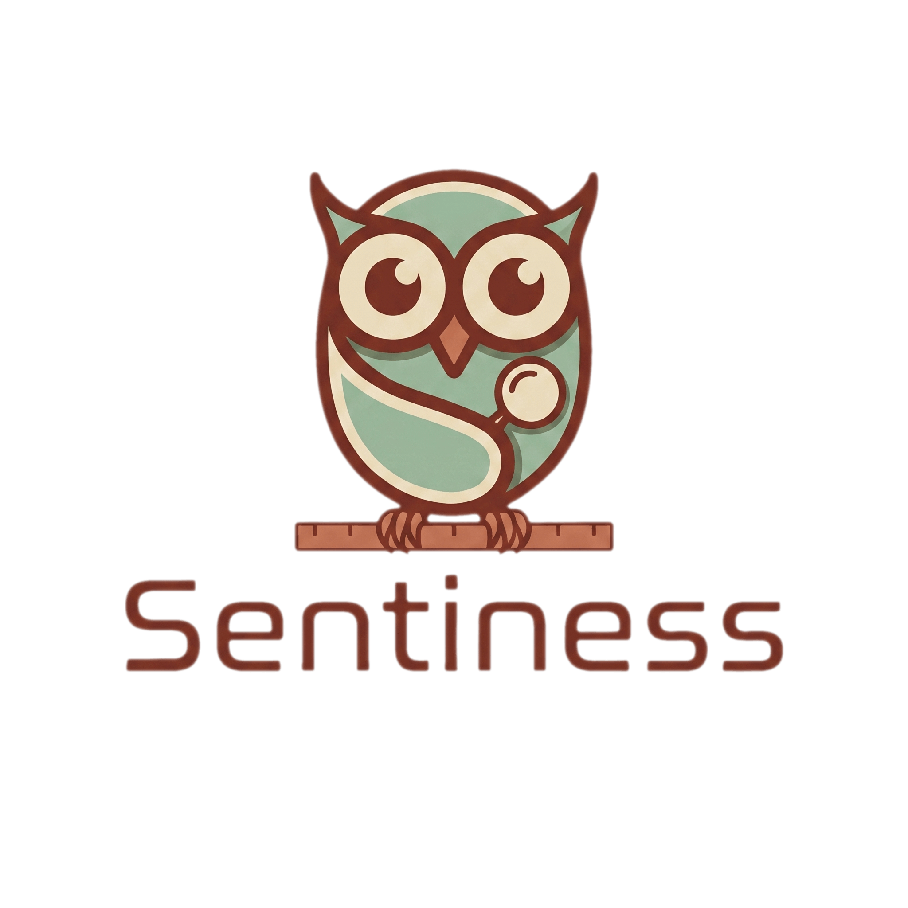

<p align="center">
  
</p>

<p align="center">
  One normalized JSON quality report for AI coding agents and CI.
</p>

Sentiness is a Node.js CLI that runs code-quality checks and emits one normalized JSON report
for AI coding agents and CI. It is baseline-aware, tier-based, and designed so agents can ask one
question before declaring work complete: what is still wrong in this codebase?

Implemented checks: Biome, ESLint, Knip, Coverage, Stryker, dependency-cruiser, deps-diff,
lockfile-lint, OSV Scanner, jscpd, Semgrep, and Playwright (E2E with screenshot/trace paths for
multimodal agents). Each check is a separate `@sentiness/check-<id>` package; the core never parses
tool-specific formats.

## How It Works (v2 global model)

Sentiness installs once, globally, like the Claude Code CLI — the target project keeps **zero
`node_modules`**. A thin launcher (`@sentiness/cli`) owns the `sentiness` binary, resolves the
version-pinned engine and checks into a global cache (`~/.sentiness/cache/`), and runs them against
your project. A project only commits universal files:

| File | Purpose | Committed |
|---|---|---|
| `sentiness.config.json` | Intent: engine pin, checks catalog (version ranges), optional zones | Yes |
| `sentiness.lock` | Exact resolved versions + integrity (determinism) | Yes |
| `.sentiness/baseline.json` | Suppressed pre-existing findings + metric baselines | Yes |
| `CLAUDE.md` / `.claude/skills/sentiness/SKILL.md` / … | Agent instructions | Yes |

`sentiness.config.json` declares intent (which engine, which checks at which version range, which
zones); `sentiness install` resolves those ranges to exact versions, writes `sentiness.lock`, and
warms the cache. `sentiness install --frozen` (for CI) materializes exactly the lock.

## Add Sentiness To A Project

```sh
npm i -g @sentiness/cli
sentiness init        # detect the stack, recommend checks, write config + lock, warm the cache
sentiness install     # (re)resolve the catalog and materialize the cache
sentiness check       # run the checks and print the normalized report JSON
```

`init` detects your stack (package manager, TypeScript, test runner, Playwright, agent instruction
files), recommends checks accordingly, and — on consent or with `--install` — runs `install` to
resolve the catalog and warm the cache. For a polyglot monorepo it detects per-directory ecosystems
(`package.json` → node, `Cargo.toml` → rust, `go.mod` → go) and writes an explicit `zones[]` block;
a single-ecosystem project omits it. `init` also creates the `.sentiness/` runtime directories and
updates `.gitignore` for local job/cache files.

Fully non-interactive:

```sh
sentiness init --yes --checks=biome,knip --install --skill=claude-code-skill --hooks
```

Each step is also available as its own command:

```sh
sentiness init --yes --checks=biome --no-baseline
sentiness install
sentiness doctor
sentiness baseline init
sentiness check --tier=fast --compact
sentiness install-hooks --push
sentiness install-skill --agent=codex
```

`baseline init` records existing findings so adoption does not block on pre-existing debt.

## Quick Start In This Checkout

This repository dogfoods Sentiness on its own code with a v2 config and a committed `sentiness.lock`:

```sh
pnpm install
pnpm build
pnpm sentiness doctor
pnpm sentiness check --tier=fast --compact
```

`doctor` may return a non-zero exit code if optional external tools (e.g. `knip`, Stryker,
dependency-cruiser, lockfile-lint, OSV Scanner, jscpd, Semgrep) are not available. That means
Sentiness is running and reporting the missing tooling; use the JSON/text output to decide what to
install for the checks you enabled.

## What The CLI Provides

| Command | Purpose |
|---|---|
| `sentiness init` | Detect the stack, recommend checks, write `sentiness.config.json` (+ optional zones), warm the cache. Supports `--yes`, `--checks=<ids>`, `--install`/`--no-install`, `--skill=<agents>`, `--hooks`/`--no-hooks`, `--no-baseline`. |
| `sentiness install` | Resolve the catalog's version ranges to exact versions, write `sentiness.lock`, and materialize the cache. `--frozen` installs exactly the lock (CI). |
| `sentiness doctor` | Load configured checks per zone, run each check's `detect()`, validate required tool config, and report install or `init-config` suggestions. Read-only. |
| `sentiness init-config` | Create default tool config files for enabled checks that ship a template (e.g. `stryker.conf.json`). Idempotent unless `--force`. |
| `sentiness check` | Run checks for a tier or trigger and print the normalized report JSON. |
| `sentiness check --background` | Spawn a background job, then inspect it with `status` and `pending`. |
| `sentiness baseline init` | Create the initial committed baseline snapshot. |
| `sentiness baseline update` | Ratchet metric baselines when metrics improve. |
| `sentiness baseline accept` | Add one current finding to the baseline with an explicit reason. |
| `sentiness baseline prune` | Remove baseline entries for findings that no longer exist. |
| `sentiness install-hooks` | Install managed pre-commit and optional pre-push hooks. |
| `sentiness install-skill` | Install managed Sentiness instructions for Claude Code, Codex, Gemini, or all. |

## Configuration

Sentiness loads `sentiness.config.js` first, then `sentiness.config.json`. A config pins the engine,
lists checks as a catalog (each entry declares exactly one of `version` or `path`), and optionally
places them in zones.

```json
{
  "schemaVersion": "2.0",
  "engine": "0.1.4",
  "checks": {
    "biome": { "version": "*", "tier": "fast" },
    "knip": { "version": "*", "tier": "standard" },
    "deps-diff": { "version": "*", "tier": "fast" },
    "coverage": {
      "version": "*",
      "tier": "slow",
      "thresholds": { "lineCoverage": 85 }
    }
  },
  "reporting": { "compact": false, "omitOk": true, "warningsAreErrors": false },
  "agents": ["claude-code-skill"]
}
```

A `version` range (e.g. `*`, `^1.2.0`) is resolved to an exact version and pinned in
`sentiness.lock`; a `path` links a check directly from the repo (used to dogfood Sentiness on its own
checks). Configured check IDs resolve to packages named `@sentiness/check-<id>`.

A polyglot monorepo adds a `zones[]` block so each subdirectory runs only its own checks:

```json
{
  "schemaVersion": "2.0",
  "engine": "0.1.4",
  "checks": {
    "biome": { "version": "*" },
    "clippy": { "version": "*" }
  },
  "zones": [
    { "path": ".", "checks": ["biome"] },
    { "path": "crates/app", "checks": ["clippy"] }
  ]
}
```

## Report Contract

The runtime source of truth is `packages/core/src/schema/report.ts`. The committed public JSON
Schema artifact is generated at `packages/core/schema/report.schema.json`.

Reports include:

- `context`: cwd, tier, trigger, mode, base/head refs, changed files, dependency deltas.
- `summary`: status, severity totals, blocking state, top issues, and check counts.
- `checks`: normalized per-check findings, metrics, skip reasons, and tool errors.
- `trend`: metric regression information when a baseline exists.
- `baseline`: whether the baseline was applied and how many findings were suppressed.
- `agentInstructions`: concise must-fix, should-fix, and informational guidance for agents.

Exit codes are `0` for non-blocking reports, `1` for blocking errors, `2` for blocking warnings,
and `3` for platform or check execution errors.

## Documentation

- [Getting started](docs/getting-started.md)
- [Writing a check](docs/writing-a-check.md)
- [Baseline strategy](docs/baseline-strategy.md)
- [Agent skill integration](docs/agent-skill.md)

## Development

```sh
pnpm build
pnpm typecheck
pnpm test
pnpm test:e2e
pnpm lint
pnpm --filter @sentiness/core generate-schema
pnpm check:release-packages
```

`pnpm test:e2e` builds the workspace first and then runs the built CLI against
`examples/demo-project`.

`pnpm check:release-packages` rebuilds the workspace and verifies that publishable packages expose
`dist` type/runtime entries and do not include source, tests, or coverage artifacts in their release
allowlist.
